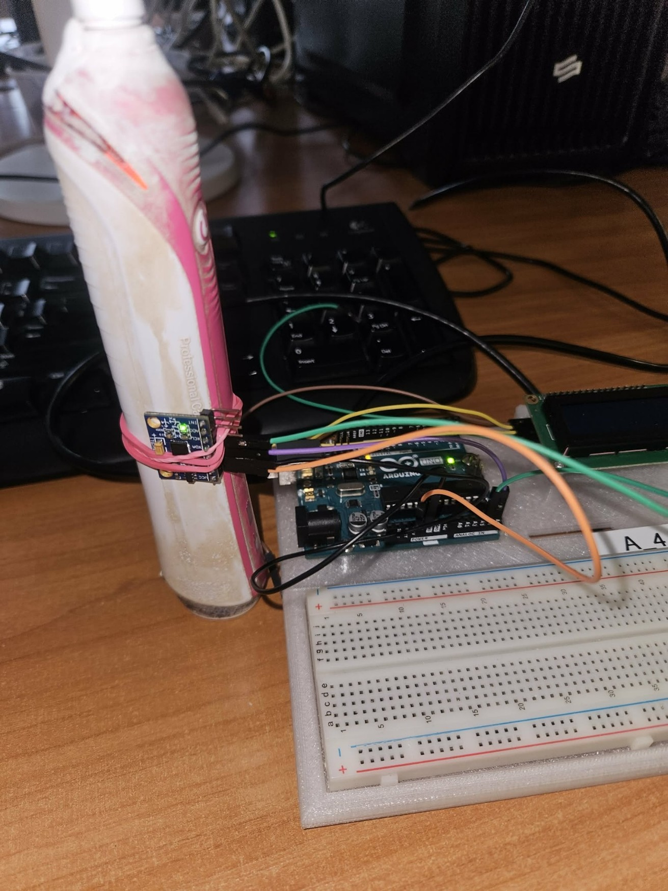
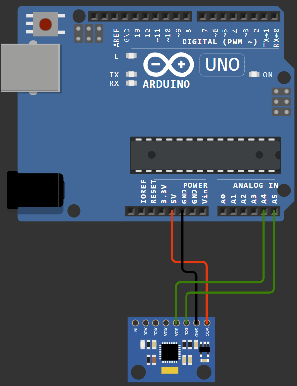

# Vibration Analysis

I measured vibrations on a running electric toothbrush using 
MPU-6050 accelerometer connected to Arduino Uno. The raw 
data was sent to a PC and analyzed using FFT to 
identify dominant vibration frequencies.

## Hardware
- Arduino Uno
- GY-521 module (MPU-6050)

## Tools & Stack
Arduino · FFT · I2C

## Photos

